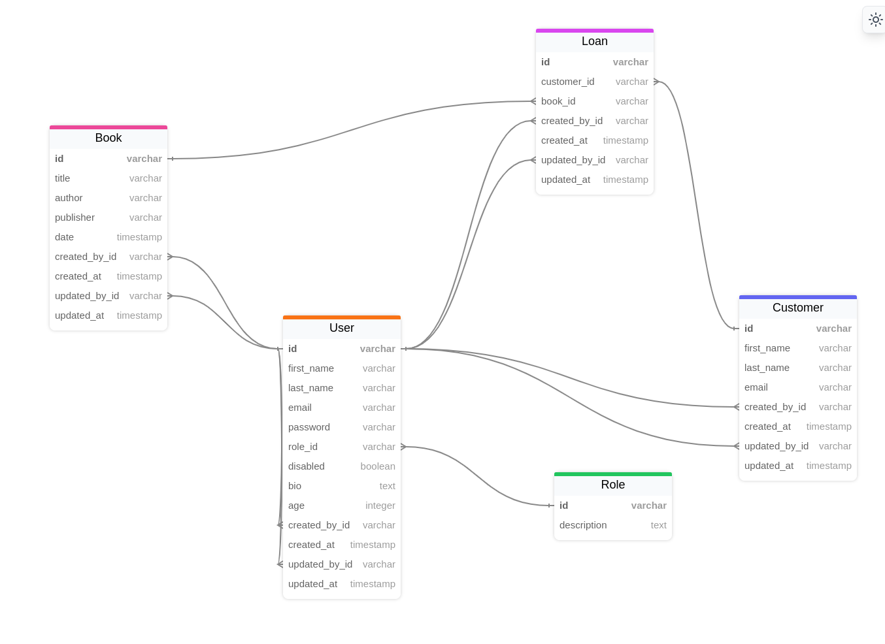

# YALM (Yet Another Library Management)

Main considerations:

- There are two different roles: admin, user.
- Admin users can create, read, update, delete all the books, customers, users, and loans.
- Standard users:
  - can create books, customers;
  - can create loans only of own books and customers;
  - can read, update and delete only own books, customers, and loans;
