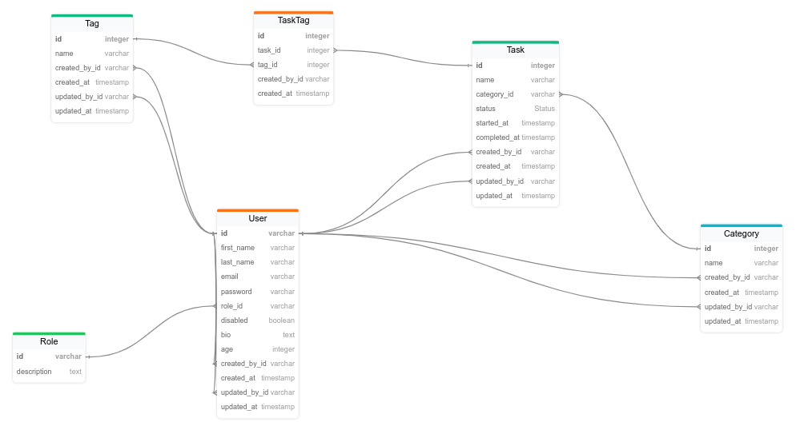

# YATMS (Yet Another Task Management System)

Main considerations:

- There are two different roles: admin, user.
- Admin users can create, read, update, delete all the tasks, categories, and tags.
- Standard users:
  - can create tasks, categories, tags;
  - can read, update and delete only own tasks, categories, and tags.
