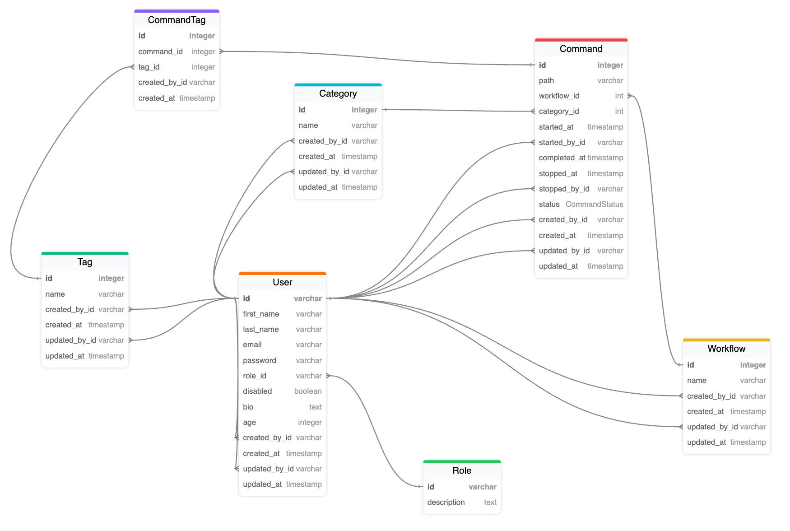

# YAWMS (Yet Another Workflow Management System)

Main considerations:

- There are two different roles: admin, user.
- Admin users can create, read, update, delete all the workflows, commands, categories, and tags.
- Standard users:
  - can create workflows, commands, categories, and tags;
  - can read, update and delete only own workflows, commands, categories, and tags.
